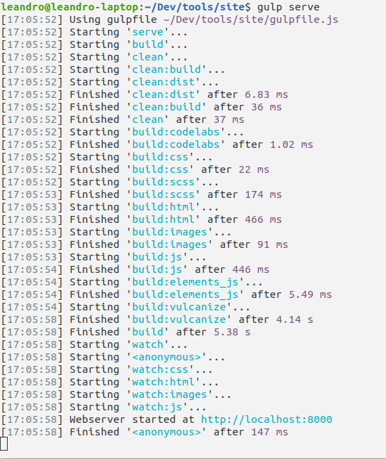
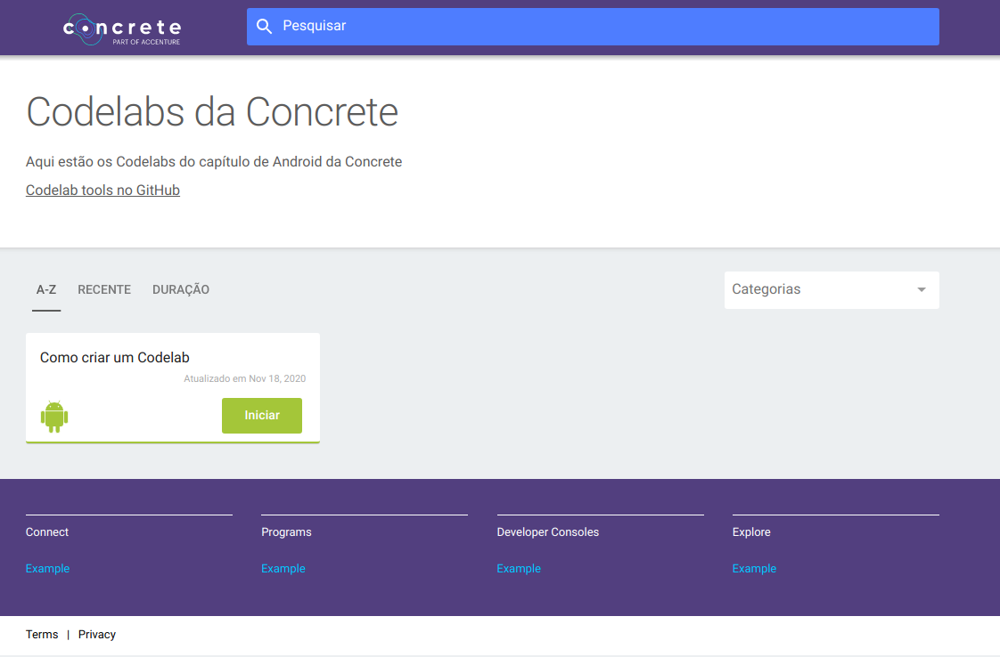
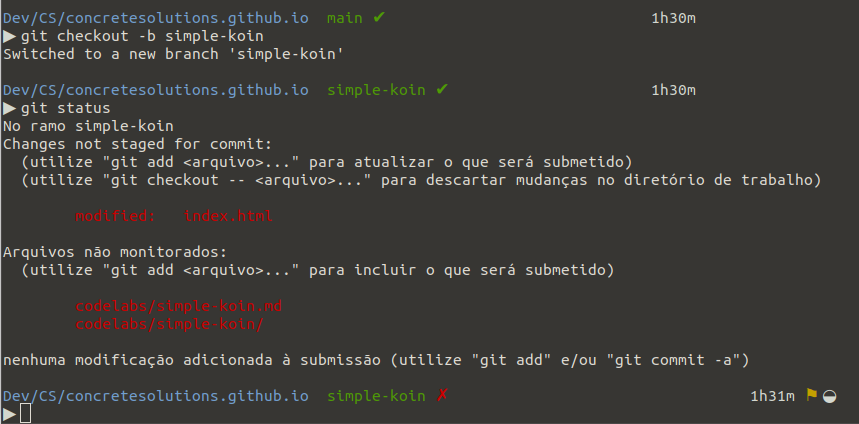
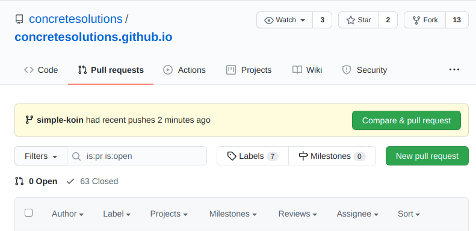
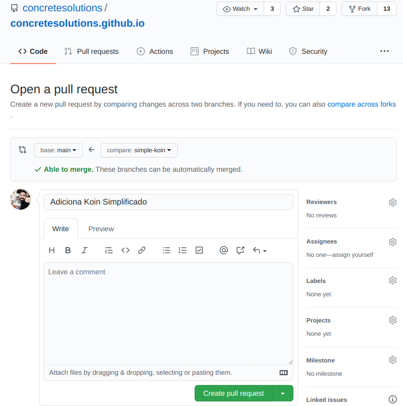

summary: Como criar um Codelab
id: como-criar-um-codelab
categories: Android
tags: tutorial, codelab
status: Published
authors: Leandro Leite
Feedback Link: http://google.com

# Como criar um Codelab

## Instalando os softwares necessários

Três softwares são necessários para criar um Codelab: `Go`, `Node.js` e `claat`

### Linguagem de programação Go

- Baixar pelo [site oficial](http://golang.org/dl)

- Extrair o conteúdo da pasta compactada no diretório padrão `/usr/local/go`

- Configurar as seguintes variáveis de ambiente:

    ```
    GOROOT=/usr/local/go
    GOPATH=$HOME/go
    PATH=$GOPATH/bin:$GOROOT/bin:$PATH

    ```

### Ambiente de execução Node.js (versão 10+)         
Baixar pelo Ubuntu com os comandos: 

```
$ curl -sL https://deb.nodesource.com/setup_lts.x | sudo -E bash -
$ sudo apt install nodejs
```

### claat: a ferramenta de linha de comando do Codelabs

Com o Go já configurado, execute o seguinte comando: 

```
go get github.com/googlecodelabs/tools/claat
```

O binário do `claat` estará em `~/go/bin`. Caso seja necessário, dê permissão de execução ao arquivo com o comando `chmod +x claat`

## Executando o projeto de Codelabs da Concrete localmente

1. Clonar o projeto através do comando `git clone https://github.com/concretesolutions/concrete-codelabs.git`

1. Ir até o diretório raiz do projeto clonado

1. Executar o comando `npm install` para instalar as dependências do projeto clonado

1. Executar o comando `sudo npm install -g gulp-cli` para instalar globalmente o `Gulp`, automatizador de tarefas em JavaScript responsável por preparar e servir o projeto localmente

1. Executar o comando `gulp serve` para servir localmente o projeto no endereço padrão `http://localhost:8000`
    <br><br>
    
    <br><br>
1. Acessar o endereço `http://localhost:8000` no navegador e ver o site hospedado localmente


## Criando seu primeiro Codelab

### Criando o Codelab

Começamos criando um arquivo Markdown no diretório `codelabs` dentro do diretório raiz do projeto

```
$ touch meu-primeiro-codelab.md
```

Obs.: evitar usar espaços e caracteres especiais no nome do arquivo

### Estruturando o Codelab

Um Codelab possui uma estrutura básica encabeçada por seus dados de identificação. Para criar um Codelab, basta seguir o modelo:

```
summary: Meu Primeiro Codelab
id: meu-primeiro-codelab
categories: Android
tags: android, tutorial, codelab
status: Published
authors: Leandro Leite
Feedback Link: http://github.com/cs-leandro-leite
```

É uma boa prática que a id do seu Codelab seja igual ao nome do seu arquivo sem a extensão e o seu *Summary* seja a escrita natural da id/nome do arquivo.

O `status: Published` é padrão para todos os Codelabs que criaremos aqui, pois todos estarão em estado "Publicado".

O *Feedback Link* é um link usado para reportar bugs encontrados no codelab.

### Adicionando conteúdo

O título do seu Codelab será definido pelo header principal do seu arquivo Markdown

```
# Meu Primeiro Codelab
```

Cada passo do seu Codelab será definido pelos headers secundários do seu arquivo Markdown

```
## Meu primeiro passo
Duration: 1
```

O campo `Duration` e seu valor são traduzidos como a duração do passo do seu Codelab em minutos. Caso esse campo seja descrito em todos os passos, o seu Codelab terá um tempo total estimado e isso será exibido ao leitor conforme o mesmo for avançando. 

É possível fazer comentários no Markdown do seu Codelab usando comentários HTML

```
<!-- Esse é o primeiro passo do meu primeiro Codelab -->
## Meu primeiro passo
Duration: 1
```

Caso seja necessário usar imagens durante a criação do Codelab, opte por baixar e disponibilizar essas imagens em um diretório interno ao diretório `assets` com o mesmo nome do seu arquivo *.md


### Resultado

Após toda a escrita, o seu Codelab deve ter uma estrutura parecida com este exemplo:

```
summary: Meu Primeiro Codelab
id: meu-primeiro-codelab
categories: Tutorial
tags: codelab, tutorial
status: Published
authors: Leandro Leite
Feedback Link: http://github.com/leanite

# Meu Primeiro Codelab

<!-- Esse é o primeiro passo do meu primeiro Codelab -->
## Meu primeiro passo
Duration: 1

Am ameno dore latiremo, me matiremo omenare reo latire. Me dimere matiro omenare ameno interimo reo dori latiremo. Emulari dori am reo adapare, imperavi me matiremo latiremo.  
Me interimo reo dori am, matiremo dore dimere dori me. Reo emulari imperavi adapare latiremo, interimo dore am omenare. Omenare dimere me interimo matiro, dori imperavi latiremo matiremo. Interimo matiremo dore emulari adapare, am ameno latiremo dimere.

<!-- Esse é o segundo passo do meu primeiro Codelab -->
## Meu segundo passo
Duration: 3

Am ameno dore latiremo, me matiremo omenare reo latire. Me dimere matiro omenare ameno interimo reo dori latiremo. Emulari dori am reo adapare, imperavi me matiremo latiremo. Me interimo reo dori am, matiremo dore dimere dori me.  
Reo emulari imperavi adapare latiremo, interimo dore am omenare. Omenare dimere me interimo matiro, dori imperavi latiremo matiremo. Interimo matiremo dore emulari adapare, am ameno latiremo dimere.

<!-- Esse é conclusão do meu primeiro Codelab -->
## Conclusão
Duration: 1

Tchau o/

```

## Visualizando seu primeiro Codelab

### Exportando seu Codelab

Após finalizar a escrita do seu arquivo Markdown, volte para o diretório `codelabs` e execute o seguinte comando:

```
$ claat export como-criar-um-codelab.md
```

Ao exportar o seu Markdown, o `claat` irá gerar um diretório com o mesmo nome do seu arquivo *.md com os arquivos do seu Codelab


Para servir novamente o site localmente, volte ao diretório `site` e execute o `gulp` com um parâmetro extra indicando o diretório `codelabs`, onde está o seu Codelab recém exportado

```
$ gulp serve --codelabs-dir=codelabs
```

Acesse novamente o endereço `http://localhost:8000` no navegador e veja o site hospedado localmente exibindo o seu Codelab na página principal



## Ganhando produtividade ao escrever um Codelab

Escrever um documento em Markdown pode trazer algumas surpresas no resultado final, mesmo com os plugins de pré-visualização de Markdown que existem em alguns editores de texto. Existe uma maneira de visualizar o resultado final do seu Codelab sem ter que fazer todos os passos necessários para publicação final.

Normalmente, escrevemos o arquivo *.md, usamos o `claat` para exportar e gerar o diretório com o arquivo *.html e reiniciamos o servidor que o Gulp está rodando. Podemos simplificar esse passo usando o comando `claat serve` no diretório `codelabs`. Esse comando faz com que o claat inicie um servidor local apenas para disponibilizar os Codelabs do diretório corrente, ignorando a estrutura do site que armazena os Codelabs.

```
$ cd codelabs
$ claat export como-criar-um-codelab.md && claat serve

```


O `claat` servirá o diretório `codelabs` no endereço `http://localhost:9000` e abrirá uma nova aba no seu navegador automaticamente ao executar o comando `claat serve`.


Para visualizar o seu Codelab, basta clicar no diretório que foi exportado pelo `claat`


Obs.: o `claat` não possui *hot reload*, ou seja, toda vez que uma alteração for feita, é necessário parar o servidor, exportar novamente o arquivo *.md e iniciar o serviço novamente através do comando `claat export como-criar-um-codelab.md && claat serve`.

## Adicionando um autor ao Codelab

É possível adicionar um autor a um Codelab. Para isso, basta seguir os seguintes passos:

1. Caso seja a primeira vez criando um Codelab, é necessário adicionar o seu avatar no projeto. Para isso, adicione uma foto sua no diretório `app/images/authors`. Como o avatar do site possui 42x42, evite adicionar uma imagem muito grande e não se esqueça de manter a proporção 1:1 da imagem.
2. Adicione manualmente a sua autoria no seu Codelab em `index.html` no diretório `build` seguindo este modelo:

    ```
    
    ```

    Adicionado a um Codelab, especificamente na `div` com a classe `card-footer`, ficará da seguinte forma:

    ```
    <a href="/codelabs/simple-koin/index.html?index=..%2F..index" on-tap="navigate"
        class="codelab-card category-kotlin"
        data-category="kotlin"
        data-title="Criando seu próprio Koin simplificado"
        data-duration="0"
        data-updated="2020-11-18T17:19:22-03:00"
        data-tags="kotlin,tutorial"
        data-pin="">
        <div class="description">Criando seu próprio Koin simplificado</div>
        <div class="card-duration">
            <span></span>
            <span>Atualizado em Nov 18, 2020</span>
        </div>
        <div class="card-footer">
            
            <div class="category-icon kotlin-icon"></div>
            <paper-button class="kotlin-bg">Iniciar</paper-button>
        </div>
    </a>

    ```

    Obs.: o arquivo `build/index.html` é gerado automaticamente toda vez que o comando `gulp serve` é executado, então tenha certeza de adicionar a sua autoria quando estiver copiando o `index.html` para abrir um Pull Request. Não é possível visualizar o autor do Codelab no projeto hospedado localmente.

## Abrindo um Pull Request para o repositório da Concrete

Primeiramente, precisamos incluir o arquivo `*.md` do Codelab que criamos na pasta `codelabs` do projeto de hospedagem local, o `concrete-codelabs`, que clonamos anteriormente.

Em seguida, devemos exportar esse Codelab executando o comando `claat export [nome do meu markdown de codelab].md` dentro da pasta `codelabs` como fizemos anteriormente.

Os arquivos que vamos submeter no Pull Request são os seguintes:

* Diretório com o Codelab convertido
* Pasta assets e as imagens do seu Codelab quando necessário
* O markdown do seu Codelab
* O `index.html` que está no diretório `build`

Copie esses arquivos, pois vamos abrir um Pull Request no repositório do site estático. Para isso, precisamos clonar o projeto do github.io através do comando `git clone https://github.com/concretesolutions/concretesolutions.github.io.git`

Já com o projeto clonado, crie uma branch a partir da branch `main` com o nome da `ID` do seu Codelab.

```
git checkout -b nome-do-meu-codelab
```

Em seguida, copie nessa branch recém criada os arquivos que separamos para subida no passo anterior. A nossa subida ficará parecida com este exemplo:



Podemos, então, adicionar os arquivos, commitar e realizar um push da nossa branch recém criada para o repositório remoto. Em seguida, precisamos ir até a parte de Pull Requests no [GitHub do projeto](https://github.com/concretesolutions/concretesolutions.github.io/pulls) e clicar em `New pull request`.



Finalmente, definimos a branch `main` como **base** e a nossa branch recém criada como **compare**. Revisamos o Pull Request para saber se está tudo certo e adicionamos um título significativo para que os avaliadores consigam entender do que se trata sem qualquer dificuldade. Se necessário, podemos incluir um breve comentário no campo disponibilizado.



Finalmente, clicamos em `Create pull request` e aguardamos que um avaliador aprove ou aponte possíveis correções no nosso Codelab.

Bons PRs, pessoal!😁